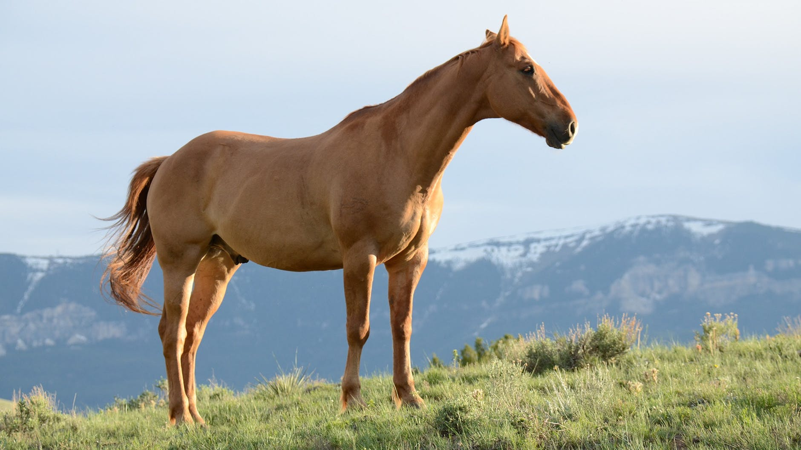

# photo-mosaic
This is a general purpose program that produces photomosaics. A photomosaic is a large picture that is constructed from a collection of smaller pictures.   

Examples    
--------
Original:   
   
Rendered:    
   

Original:   
   
Rendered:   
   

Running the Program    
-------------------
A typical user-interaction with the program through the console:    
```
photomosaic.Model methods
  h - Help!
  ? - Comparators, Filters, and Metrics
  r - resetPictureDatabase
  l - loadMoreInPictureDatabase
  d - displayPictureDatabase
  s - shift
  < - resortPictureDatabase
  f - setFilter
  m - setMetric
  L - loadPictureToRender
  S - scalePictureToRender
  R - renderPicture
  q - quit

Enter Command[h?rlds<fmLSRq]: m
Enter Metric Name: QuadRGBMetric
model.getResponse() = photomosaic.QuadMetric was applied to 0 pictures.


photomosaic.Model methods
  h - Help!
  ? - Comparators, Filters, and Metrics
  r - resetPictureDatabase
  l - loadMoreInPictureDatabase
  d - displayPictureDatabase
  s - shift
  < - resortPictureDatabase
  f - setFilter
  m - setMetric
  L - loadPictureToRender
  S - scalePictureToRender
  R - renderPicture
  q - quit

Enter Command[h?rlds<fmLSRq]: l
Enter width  for Picture DB images (in pixels)[1,1000](13): 20
Enter height for Picture DB images (in pixels)[1,1000](16): 20
See Picture Database Selection pop-up window

model.getResponse() = Attempting to load 836 pictures
model.getResponse() =   Loaded 0 pictures
model.getResponse() =   Loaded 50 pictures
model.getResponse() =   Loaded 100 pictures
model.getResponse() =   Loaded 150 pictures
model.getResponse() =   Loaded 200 pictures
model.getResponse() =   Loaded 250 pictures
model.getResponse() =   Loaded 300 pictures
model.getResponse() =   Loaded 350 pictures
model.getResponse() =   Loaded 400 pictures
model.getResponse() =   Loaded 450 pictures
model.getResponse() =   Loaded 500 pictures
model.getResponse() =   Loaded 550 pictures
model.getResponse() =   Loaded 600 pictures
model.getResponse() =   Loaded 650 pictures
model.getResponse() =   Loaded 700 pictures
model.getResponse() =   Loaded 750 pictures
model.getResponse() =   Loaded 800 pictures
model.getResponse() = Loaded 836 pictures
Picture database now contains 836 pictures


photomosaic.Model methods
  h - Help!
  ? - Comparators, Filters, and Metrics
  r - resetPictureDatabase
  l - loadMoreInPictureDatabase
  d - displayPictureDatabase
  s - shift
  < - resortPictureDatabase
  f - setFilter
  m - setMetric
  L - loadPictureToRender
  S - scalePictureToRender
  R - renderPicture
  q - quit

Enter Command[h?rlds<fmLSRq]: L

See Picture to Render Selection pop-up window

model.getResponse() = Loaded C:\xxx\photo-mosaic\examples\original-pic1.jpg
Picture is 1024x680


photomosaic.Model methods
  h - Help!
  ? - Comparators, Filters, and Metrics
  r - resetPictureDatabase
  l - loadMoreInPictureDatabase
  d - displayPictureDatabase
  s - shift
  < - resortPictureDatabase
  f - setFilter
  m - setMetric
  L - loadPictureToRender
  S - scalePictureToRender
  R - renderPicture
  q - quit

Enter Command[h?rlds<fmLSRq]: R
Picture to Render is 1024 x 680
Enter # pixels for width in sample[1,1024](20): 10
Sample height (conforming to image database) 10
Rendered picture will contain 6936 tiles: 102 x 68

Enter maximum # of times to reuse any picture[9,6936](9): 300
Enter minimum distance between picture reuse [1.0,102.0](1.0): 2
model.getResponse() = Rendering 0 percent done
model.getResponse() = Rendering 10 percent done
model.getResponse() = Rendering 20 percent done
model.getResponse() = Rendering 30 percent done
model.getResponse() = Rendering 40 percent done
model.getResponse() = Rendering 50 percent done
model.getResponse() = Rendering 60 percent done
model.getResponse() = Rendering 70 percent done
model.getResponse() = Rendering 80 percent done
model.getResponse() = Rendering 90 percent done
Save rendered picture? y/n: [y n Y N]: y
See save as popup window
Saved at C:\xxx\mosaic.png
```

